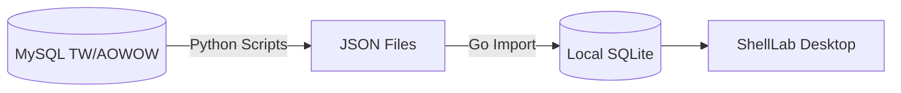

# ShellLab - WoW Toolkit Desktop Edition

A comprehensive, cross-platform desktop application suite for World of Warcraft (Turtle WoW), providing powerful tools for item browsing, character planning, and gameplay optimization.

## 🎯 Project Overview

**ShellLab** is a standalone desktop application that brings essential WoW utilities outside the game client. Built with modern web technologies, it provides a fast, feature-rich environment for:

- 📦 **Loot Browser** - Browse AtlasLoot database with advanced search
- 🌳 **Talent Simulator** - Plan and optimize talent builds (planned)
- ⚔️ **Equipment Manager** - Simulate gear setups and compare stats (planned)
- 📊 **Stat Calculator** - Calculate character attributes with precision (planned)
- 💥 **DPS Simulator** - Analyze and optimize damage output (planned)
- ✨ **Enchant Browser** - Explore enchantment effects and combinations (planned)

## 🏗️ Architecture

### Technology Stack

- **Backend**: Go + Wails + SQLite
- **Frontend**: React + TypeScript + Vite
- **Database**: SQLite (items, loot tables, icons)
- **Data Sources**:
  - AtlasLoot Enhanced (Lua files)
  - Turtle WoW Database (SQL dumps)
  - AoWoW Icon Database

### Data Pipeline

**New Architecture (ETF: MySQL -> JSON -> SQLite)**

To decouple the application from the production MySQL database, we use a JSON-based intermediate format:

1.  **Extract (Python)**: Export data from MySQL tables to JSON files (`data/*.json`).
2.  **Import (Go)**: On application startup, the Go backend reads these JSON files and populates the local SQLite database.



## 🚀 Getting Started

### 1. Run Application

Start the application. It will automatically detect the JSON files in `data/` and import them into the internal SQLite database on startup.

```bash
wails dev
```

## 📊 Data Import Pipeline

### Initial Setup

```bash
# 1. Initialize database schema
go run scripts/db_import/main.go init

# 2. Extract items from SQL (one-time or when SQL updates)
go run scripts/db_import/main.go extract-sql

# 3. Import items to database
go run scripts/db_import/main.go import-items

# 4. Import icon mappings
go run scripts/import_icons/main.go

# 5. Extract AtlasLoot data
go run scripts/extract_atlasloot/main.go

# 6. Download item icons (optional)
go run scripts/download_icons/main.go
```

### Incremental Updates

For custom item modifications, use `data/item_template_update.json`:

```bash
# Edit update file
cp data/item_template_update.json.example data/item_template_update.json
edit data/item_template_update.json

# Re-import (auto-applies updates)
go run scripts/db_import/main.go import-items
```

See `scripts/db_import/README.md` for detailed pipeline documentation.

## 🎮 Features

### Current: Loot Browser ✅

- 📚 **Complete AtlasLoot Integration**

  - 7 categories, 27 modules, 895+ loot tables
  - 7,248 items with full stats and tooltips
  - Hierarchical navigation (Category → Module → Table → Items)

- 🔍 **Advanced Search**

  - Search by item name
  - Filter by quality, class, level
  - Quick access to loot sources

- 💎 **WoW-Style Tooltips**
  - Authentic item stat display
  - Color-coded quality indicators
  - Complete item information

### Planned Features 🚧

- 🌳 **Talent Simulator**

  - All class talent trees
  - Build sharing and import/export
  - Talent point calculator

- ⚔️ **Equipment Manager**

  - Virtual gear slots
  - Set bonus tracking
  - Gear comparison tools

- 📊 **Stat Calculator**

  - Real-time attribute calculation
  - Stat weight analysis
  - Optimization suggestions

- 💥 **DPS Simulator**

  - Combat rotation simulation
  - Gear impact analysis
  - DPS ranking and comparison

- ✨ **Enchant Browser**
  - All enchantment effects
  - Slot-specific filtering
  - Cost and requirements display

## 📚 Documentation

- `scripts/db_import/README.md` - Data import pipeline
- `docs/` - Additional documentation (TBD)

## 🔧 Development

### Database Schema

```sql
-- Core tables
items              -- Item templates (60K+ items)
atlasloot_*        -- Loot hierarchy (4-tier structure)
icons              -- Icon mappings (planned)

-- Future tables
talents            -- Talent tree data
enchants           -- Enchantment effects
item_sets          -- Set bonuses
```

### API Structure

```go
// Backend (Go)
GetRootCategories()           // AtlasLoot categories
GetChildCategories(parentId)  // Modules under category
GetTables(parentId)           // Boss/table list
GetTableLoot(tableId)         // Item list for table
GetItemTooltip(itemId)        // Tooltip data

// Future APIs
GetTalentTree(classId)
CalculateStats(gear[])
SimulateDPS(config)
```

## 🤝 Contributing

Contributions are welcome! This is an educational project for the Turtle WoW community.

## 📝 License

This project is for educational and personal use.

## 🔗 References

- [Turtle WoW](https://turtle-wow.org/)
- [AtlasLoot Enhanced](https://github.com/Otari98/AtlasLoot)
- [AoWoW Database](https://github.com/Sarjuuk/aowow)
- [TradeSkills Data](https://github.com/refaim/TradeSkillsData)
- [Turtle-WoW Emulation Server Source Code](https://github.com/brian8544/turtle-wow)

## 🎯 Roadmap

- [x] **Phase 1**: Loot Browser

  - [x] Database schema
  - [x] Data import pipeline
  - [x] AtlasLoot integration
  - [x] Item tooltips
  - [x] Search functionality

- [ ] **Phase 2**: Talent Simulator

  - [ ] Talent tree data extraction
  - [ ] Interactive tree UI
  - [ ] Build calculator

- [ ] **Phase 3**: Equipment Manager

  - [ ] Gear slot system
  - [ ] Stat calculation engine
  - [ ] Set bonus tracking

- [ ] **Phase 4**: Advanced Simulators
  - [ ] DPS simulation
  - [ ] Stat optimization
  - [ ] Enchant browser

---

**Built with ❤️ for the Turtle WoW Community**
